# Architecture Overview

## C4 Model - System Context Diagram

```mermaid
graph TB
    subgraph System
        MB["🧠 Magic Bus<br/>Compass 360"]
    end
    
    subgraph Users
        Youth["👥 Youth Users<br/>Learning & Feedback"]
        Admin["👨‍💼 Admin Users<br/>System Management"]
        Stakeholder["🎯 Stakeholders<br/>Decision Making"]
    end
    
    subgraph External
        Azure["☁️ Azure Blob Storage<br/>APAC Datasets"]
        Email["📧 Email Service<br/>Survey Distribution"]
    end
    
    Youth -->|Register, Learn, Feedback| MB
    Admin -->|Configure, Monitor| MB
    Stakeholder -->|View Insights| MB
    MB -->|Read Data| Azure
    MB -->|Send Surveys| Email
```



## C4 Model - Container Diagram

```mermaid
graph TB
    subgraph "Client Layer"
        Web["🌐 Web Application<br/>(Streamlit)<br/>- 6 Pages<br/>- Multi-role UI<br/>- Responsive"]
    end
    
    subgraph "Application Layer"
        Auth["🔐 Auth Module<br/>- User Management<br/>- Role Control<br/>- Session Mgmt"]
        Youth["👤 Youth Service<br/>- Profile Management<br/>- Progress Tracking<br/>- Feedback"]
        Admin["⚙️ Admin Service<br/>- Module Config<br/>- Survey Mgmt<br/>- System Health"]
        DI["📊 Decision Intelligence<br/>- Feature Compute<br/>- KPI Generation<br/>- Analytics"]
    end
    
    subgraph "Data Layer"
        DB["🗄️ SQLite Database<br/>- 9 Tables<br/>- 50 Users<br/>- 16 Modules"]
        Cache["💾 Cache Layer<br/>- Feature Cache<br/>- Dataset Cache<br/>- Session Cache"]
    end
    
    subgraph "External Services"
        Azure["☁️ Azure Blob<br/>- 25+ Datasets<br/>- APAC Region<br/>- Read-Only"]
    end
    
    Web -->|API Calls| Auth
    Web -->|API Calls| Youth
    Web -->|API Calls| Admin
    Web -->|API Calls| DI
    
    Auth -->|Query| DB
    Youth -->|Query/Update| DB
    Admin -->|Query/Update| DB
    DI -->|Query| DB
    DI -->|Cache| Cache
    
    DI -->|Read| Azure
    Auth -->|Store/Verify| Cache
```



## C4 Model - Component Diagram (Detail View)


## C4 Model - Code Level (Detailed)


## Data Flow Architecture

### Request Flow - Youth Dashboard


### Request Flow - Decision Intelligence


## Technology Stack Architecture


## Integration Points

### Database Integration


### Azure Integration


## Performance Considerations

### Caching Strategy


### Scalability Considerations

| Component | Current Capacity | Bottleneck | Solution |
|-----------|-----------------|-----------|----------|
| Users | 50 | Session Management | Implement session store |
| Features | 6 | Computation Time | Parallel processing |
| Queries | 100 RPS | SQLite Locks | Move to PostgreSQL |
| Azure Reads | 25+ datasets | Authentication | Use Service Principal |

---

## Deployment Architecture

### Development

```
Local Machine (Windows)
├── .venv (Python 3.11)
├── SQLite (data/mb_compass.db)
├── Streamlit (port 8501)
└── Code (Git)
```

### Production

```
Server/Cloud
├── Docker Container (Python 3.11)
├── PostgreSQL (Persistent Storage)
├── Streamlit Server (gunicorn + nginx)
├── Azure Blob (Read-Only)
└── CI/CD Pipeline (GitHub Actions)
```

---

**Last Updated**: January 29, 2026
