# User Journey Flows - Detailed Process Diagrams

## 1. Youth Registration Flow - Detailed

### High-Level Process

```mermaid
flowchart TD
    Start["🔗 User Visits Platform"] -->|HTTP Request| A["Streamlit App<br/>Port 8501"]
    A -->|Load| B["Check Session"]
    B -->|No Session| C["Show Login Page"]
    B -->|Has Session| D["Redirect to Dashboard"]
    C -->|Click 'Register'| E["Show Registration Form"]
    E -->|Fill Form| F{Validate Input}
    F -->|Invalid| G["Show Error<br/>- Invalid Email<br/>- Weak Password<br/>- Email Exists"]
    G -->|Retry| E
    F -->|Valid| H["Hash Password"]
    H -->|Create| I["Insert into mb_users<br/>- user_id (auto)<br/>- email<br/>- password_hash<br/>- role = 'student'<br/>- created_at"]
    I -->|Success| J["Create Session<br/>st.session_state"]
    I -->|Failure| K["Show DB Error"]
    J -->|Redirect| L["Youth Dashboard"]
    K -->|Retry| E
    L -->|Load| M["Display Profile<br/>- Student ID<br/>- Email<br/>- Institution"]
    M -->|End| N["✅ Registration Complete"]
```

### Detailed Sequence Diagram

```mermaid
sequenceDiagram
    actor User as Youth User<br/>Browser
    participant UI as Streamlit UI<br/>0_login.py
    participant Auth as Auth Module<br/>Authentication
    participant Hash as Password<br/>Hashing
    participant DB as SQLite DB<br/>mb_compass.db
    participant Session as Session Manager<br/>st.session_state
    
    User->>UI: Click "Register" Button
    UI->>UI: Display Registration Form
    Note over UI: Form Fields:<br/>- Email<br/>- Password (confirm)<br/>- Full Name<br/>- Institution<br/>- Education Level
    
    User->>UI: Fill & Submit Form
    UI->>Auth: validate_input(form_data)
    Auth->>Auth: Check Email Format
    Auth->>Auth: Check Password Strength
    Auth->>DB: SELECT * FROM mb_users WHERE email=?
    
    alt Email Already Exists
        DB-->>Auth: User Record Found
        Auth-->>UI: Error: "Email Already Registered"
        UI-->>User: Show Error Message
        User->>UI: Correct Email & Retry
    else Email is Unique
        DB-->>Auth: No Records Found
        Auth->>Hash: hash_password(password)
        Hash-->>Auth: password_hash
        Auth->>DB: INSERT INTO mb_users
        Note over DB: INSERT VALUES<br/>- null (auto id)<br/>- email<br/>- password_hash<br/>- 'student' (role)<br/>- full_name<br/>- institution<br/>- education_level<br/>- NULL (phone)<br/>- NULL (dob)<br/>- NULL (skills)<br/>- NOW() (created_at)
        
        DB-->>Auth: Success (user_id=X)
        Auth->>Session: Create Session
        Note over Session: st.session_state updates:<br/>- logged_in = True<br/>- user_id = X<br/>- email = user@email.com<br/>- role = 'student'<br/>- full_name = name
        Session-->>Auth: Session Created
        Auth-->>UI: Success
        UI->>UI: Clear Form
        UI->>UI: Redirect Page
        UI-->>User: "Welcome! → Youth Dashboard"
    end
```

### Error Handling Flow

```mermaid
flowchart TD
    Input["User Registration<br/>Input"] -->|Validate| A{Email Valid?}
    A -->|No| E1["❌ Show Error<br/>Invalid Email Format"]
    E1 -->|User Retry| Input
    A -->|Yes| B{Password<br/>Strong?}
    B -->|No| E2["❌ Show Error<br/>Password < 8 chars"]
    E2 -->|User Retry| Input
    B -->|Yes| C{Email Unique<br/>in DB?}
    C -->|No| E3["❌ Show Error<br/>Email Already Registered"]
    E3 -->|User Retry| Input
    C -->|Yes| D["✅ Create User<br/>in Database"]
    D -->|Insert Success| Success["✅ Registration<br/>Complete"]
    D -->|DB Error| E4["❌ Show Error<br/>Database Error"]
    E4 -->|Retry| D
```

---

## 2. Youth Dashboard Flow - Complete User Journey

### Youth Dashboard Process

### Detailed Sequence Diagram - Profile & Progress

### Feedback Survey Submission Flow

```mermaid
sequenceDiagram
    participant Youth as Youth User
    participant SurveyUI as Feedback Form<br/>Streamlit UI
    participant Validator as Form Validator
    participant DB as SQLite DB
    
    Youth->>SurveyUI: Click "Submit Feedback"
    SurveyUI->>Youth: Show Survey Questions
    
    Note over SurveyUI: Survey Questions:<br/>1. Role Match (1-5)<br/>2. Environment (1-5)<br/>3. Growth (1-5)<br/>4. Compensation (1-5)<br/>5. Comments (text)
    
    Youth->>SurveyUI: Fill All Answers
    Youth->>SurveyUI: Click "Submit"
    
    SurveyUI->>Validator: validate_survey(form_data)
    Validator->>Validator: Check All Fields Filled
    Validator->>Validator: Check Ratings in Range
    Validator->>Validator: Check Comments < 500 chars
    
    alt Validation Fails
        Validator-->>SurveyUI: Error Messages
        SurveyUI-->>Youth: Show Errors & Highlights
        Youth->>SurveyUI: Correct Errors
        SurveyUI->>Validator: validate_survey(form_data)
    else Validation Passes
        Validator-->>SurveyUI: OK
        SurveyUI->>DB: INSERT INTO youth_feedback_surveys
        Note over DB: INSERT VALUES<br/>- survey_id (auto)<br/>- user_id<br/>- email<br/>- placement_company<br/>- job_title<br/>- rating_1, rating_2, ...<br/>- comments<br/>- NOW() (created_at)
        
        DB-->>SurveyUI: Inserted (survey_id=X)
        SurveyUI->>SurveyUI: Refresh Page
        SurveyUI-->>Youth: "✅ Feedback Saved Successfully"
    end
```

---

## 3. Admin Control Flow - Complete

### Admin Dashboard Process

```mermaid
flowchart TD
    A["Admin Logs In"] -->|Role Check| B{Is Admin?}
    B -->|No| C["❌ Access Denied"]
    B -->|Yes| D["Load Admin Portal<br/>3_magicbus_admin.py"]
    
    D -->|Query| E["Load Dashboard Data<br/>- Total Users<br/>- Module Count<br/>- Survey Status"]
    
    D -->|Display| F["Admin Menu"]
    
    F -->|Option 1| G["👥 User Management"]
    F -->|Option 2| H["📚 Module Management"]
    F -->|Option 3| I["📋 Survey Distribution"]
    F -->|Option 4| J["📊 System Reports"]
    
    G -->|Action| G1["List All Users<br/>- User ID<br/>- Email<br/>- Role<br/>- Created Date"]
    G1 -->|Search| G2["Filter Users<br/>- By Email<br/>- By Role<br/>- By Date"]
    
    H -->|Action| H1["View Modules<br/>- Module List<br/>- Completion Stats<br/>- Learner Count"]
    H1 -->|Edit| H2["Create/Edit Module<br/>- Title<br/>- Description<br/>- Duration<br/>- Skills"]
    H2 -->|Save| H3["Store in DB<br/>INSERT/UPDATE<br/>learning_modules"]
    
    I -->|Action| I1["Create Survey<br/>- Select Template<br/>- Choose Recipients<br/>- Set Deadline"]
    I1 -->|Send| I2["Distribute Survey<br/>- Send Emails<br/>- Create Log Records<br/>- Track Opens"]
    I2 -->|Store| I3["Log Distribution<br/>INSERT<br/>survey_distribution_logs"]
    
    J -->|Action| J1["View Reports<br/>- Completion Rate<br/>- Dropout Risk<br/>- Engagement Stats"]
```

### Admin Workflow - Detailed Sequence

```mermaid
sequenceDiagram
    participant Admin as Admin User
    participant Portal as Admin Portal<br/>3_magicbus_admin.py
    participant AdminSvc as Admin Service
    participant DB as SQLite DB
    participant Email as Email Service<br/>Background Job
    
    Admin->>Portal: Navigate to Admin Portal
    Portal->>AdminSvc: load_dashboard()
    AdminSvc->>DB: SELECT COUNT(*) FROM mb_users
    DB-->>AdminSvc: 50
    AdminSvc->>DB: SELECT COUNT(*) FROM learning_modules
    DB-->>AdminSvc: 16
    AdminSvc-->>Portal: Dashboard Data
    Portal-->>Admin: Show Admin Dashboard
    
    Note over Portal: Admin Options:<br/>- User Management<br/>- Module Management<br/>- Survey Distribution<br/>- System Health
    
    Admin->>Portal: Click "Create New Module"
    Portal-->>Admin: Show Module Form
    
    Admin->>Portal: Fill Module Details
    Note over Admin: - Title: "Leadership Skills"<br/>- Duration: 4 weeks<br/>- Skills: Leadership, Communication<br/>- Description: Learn to lead
    
    Admin->>Portal: Submit Form
    Portal->>AdminSvc: create_module(module_data)
    AdminSvc->>AdminSvc: Validate Module
    AdminSvc->>DB: INSERT INTO learning_modules
    Note over DB: INSERT VALUES<br/>- module_id (auto)<br/>- title<br/>- description<br/>- duration<br/>- skills<br/>- status = 'active'
    DB-->>AdminSvc: Inserted (module_id=17)
    AdminSvc-->>Portal: Success
    Portal-->>Admin: "✅ Module Created"
    
    Admin->>Portal: Click "Send Survey"
    Portal-->>Admin: Show Survey Distribution Form
    
    Admin->>Portal: Select Recipients & Template
    Admin->>Portal: Submit
    Portal->>AdminSvc: send_survey(recipients, template)
    AdminSvc->>DB: SELECT * FROM mb_users WHERE role='student'
    DB-->>AdminSvc: 50 Users
    AdminSvc->>Email: Send Emails (async)
    AdminSvc->>DB: INSERT INTO survey_distribution_logs (x50 records)
    Note over DB: Log each send:<br/>- recipient_email<br/>- survey_type<br/>- sent_date<br/>- opened = False
    DB-->>AdminSvc: Inserted
    AdminSvc-->>Portal: Success
    Portal-->>Admin: "✅ Surveys Sent to 50 Recipients"
    Email->>Email: Send 50 Emails
```

### Module Creation & Management

```mermaid
flowchart TD
    A["Admin: Create Module"] -->|Form| B["Enter Module Details<br/>- Title<br/>- Description<br/>- Duration<br/>- Skills<br/>- Prerequisites<br/>- Difficulty"]
    B -->|Validate| C{Valid Input?}
    C -->|No| D["Show Validation<br/>Errors"]
    D -->|Correct| B
    C -->|Yes| E["Store in DB"]
    E -->|Query| F["INSERT INTO<br/>learning_modules"]
    F -->|Success| G["✅ Module Created<br/>module_id=X"]
    F -->|Failure| H["❌ Database Error"]
    
    G -->|Next| I["Assign to Youth<br/>- Select Module<br/>- Select Students"]
    I -->|Assign| J["UPDATE learning_modules<br/>SET user_id = Y"]
    J -->|Success| K["✅ Assigned to<br/>N Students"]
    
    K -->|Track| L["View Completion<br/>- Modules Assigned<br/>- Modules Completed<br/>- Completion %"]
    
    L -->|Report| M["Generate Report<br/>- Per Module Stats<br/>- Overall Stats<br/>- Effectiveness"]
```

---

## 4. Decision Intelligence Flow - Complete

### Decision Intelligence Dashboard Process

### Detailed Feature Computation Flow

### Proposal Generation Flow

---

## Data State Transitions

### User State Machine

---

**Last Updated**: January 29, 2026
