# Data Model & Database Schema

## Entity Relationship Diagram

```mermaid
erDiagram
    MB_USERS ||--o{ LEARNING_MODULES : "has"
    MB_USERS ||--o{ CAREER_SURVEYS : "completes"
    MB_USERS ||--o{ YOUTH_FEEDBACK_SURVEYS : "submits"
    MB_USERS ||--o{ EMPLOYER_FEEDBACK_SURVEYS : "receives"
    MB_USERS ||--o{ SURVEY_DISTRIBUTION_LOGS : "targeted"
    SURVEY_TEMPLATES ||--o{ SURVEY_DISTRIBUTION_LOGS : "uses"
    LEARNING_MODULES ||--o{ SURVEY_TEMPLATES : "relates"
    
    MB_USERS {
        int user_id PK "Primary Key"
        string login_id UK "Unique: Email"
        string password "Hashed"
        string student_id "Format: MB-APAC-2026-XXXXX"
        string role "student, admin, instructor"
        string email UK
        string full_name
        string phone
        date dob
        string institution
        string education_level
        string skills "CSV or JSON"
        timestamp created_at
    }
    
    LEARNING_MODULES {
        int module_assignment_id PK
        int user_id FK
        string module_id "Unique module identifier"
        string title
        string description
        int duration "Hours"
        string skills "Comma-separated"
        string prerequisites
        string difficulty_level "Beginner, Intermediate, Advanced"
        string status "active, inactive, completed"
        int progress "0-100"
        date started_date
        date completed_date
        date assigned_date
    }
    
    CAREER_SURVEYS {
        int survey_id PK
        int user_id FK
        string student_id
        json survey_data "JSON responses"
        timestamp completed_at
    }
    
    YOUTH_FEEDBACK_SURVEYS {
        int survey_id PK
        int user_id FK
        string student_id FK
        string placement_company
        string job_title
        date survey_date
        date sent_date
        date completed_date
        string completion_status "pending, completed"
        int overall_performance "1-5"
        int technical_skills "1-5"
        int communication_skills "1-5"
        int teamwork "1-5"
        int work_ethic "1-5"
        int punctuality "1-5"
        int reliability "1-5"
        int problem_solving "1-5"
        string strengths "Text"
        string areas_for_improvement "Text"
        boolean would_rehire
        string feedback_comments
        int recommendation_score "1-10"
        timestamp created_at
    }
    
    EMPLOYER_FEEDBACK_SURVEYS {
        int survey_id PK
        string student_id FK
        string employer_name
        string employer_email
        string job_title
        date survey_date
        date sent_date
        date completed_date
        string completion_status
        int overall_performance "1-5"
        int technical_skills "1-5"
        int communication_skills "1-5"
        int teamwork "1-5"
        int work_ethic "1-5"
        int punctuality "1-5"
        int reliability "1-5"
        int problem_solving "1-5"
        string strengths
        string areas_for_improvement
        boolean would_rehire
        string feedback_comments
        int recommendation_score "1-10"
        timestamp created_at
    }
    
    SURVEY_TEMPLATES {
        int template_id PK
        string template_type "youth_feedback, employer_feedback, career"
        string template_name
        json questions_json "Array of questions"
        int version "Versioning"
        boolean is_active
        date created_date
    }
    
    SURVEY_DISTRIBUTION_LOGS {
        int log_id PK
        string survey_type "youth_feedback, employer_feedback"
        string recipient_email
        string recipient_type "youth, employer"
        int survey_id FK
        string student_id FK
        date sent_date
        boolean opened "Click tracking"
        date opened_date
        boolean completed
        date completion_date
        string survey_link "Unique token"
    }
```



## Feature Tables

### 1. student_daily_features (50 rows)

| Column | Type | Example | Purpose |
|--------|------|---------|---------|
| user_id | INT | 1 | Link to student |
| student_id | STRING | MB-APAC-2026-ABC | Student identifier |
| email | STRING | student@magicbus | Contact |
| registration_date | DATETIME | 2026-01-29 | Onboarding date |
| modules_assigned | INT | 2 | Total modules |
| modules_completed | INT | 1 | Finished count |
| avg_completion_pct | INT | 50 | Average progress |
| modules_started | INT | 2 | Started count |
| days_since_registration | INT | 15 | Account age |
| feature_timestamp | DATETIME | NOW() | Computation time |

### 2. student_dropout_risk (50 rows)

| Column | Type | Example | Purpose |
|--------|------|---------|---------|
| user_id | INT | 1 | Student ID |
| student_id | STRING | MB-APAC-2026-ABC | Identifier |
| email | STRING | student@magicbus | Contact |
| modules_assigned | INT | 2 | Context |
| modules_completed | INT | 1 | Context |
| modules_started | INT | 1 | Context |
| avg_completion_pct | INT | 50 | Context |
| days_since_registration | INT | 15 | Context |
| dropout_risk_level | ENUM | HIGH/MEDIUM/LOW | **Risk Level** |
| risk_score | INT | 1-9 | **Risk Score** |
| risk_reason | STRING | "No modules started" | **Reason** |
| risk_computed_at | DATETIME | NOW() | Computation time |

**Risk Scoring Logic:**
- HIGH: risk_score ≥ 7 (No activity, low completion)
- MEDIUM: risk_score 4-6 (Some activity, moderate risk)
- LOW: risk_score ≤ 3 (Active, good progress)

### 3. student_sector_fit (50 rows)

| Column | Type | Example | Purpose |
|--------|------|---------|---------|
| user_id | INT | 1 | Student ID |
| student_id | STRING | MB-APAC-2026-ABC | Identifier |
| sector_interests | STRING | "Design & UI/UX" | **Interest** |
| interest_confidence | INT | 1-100 | **Confidence** |
| skill_readiness_score | INT | 1-100 | **Skill Level** |
| sector_fit_score | INT | 0-100 | **Overall Fit** |
| readiness_status | ENUM | Green/Amber/Red | **Status** |
| computed_at | DATETIME | NOW() | Computation time |

**Status Mapping:**
- Green: fit_score ≥ 70 (Well-aligned)
- Amber: fit_score 50-69 (Moderate alignment)
- Red: fit_score < 50 (Poor alignment)

### 4. module_effectiveness (16 rows)

| Column | Type | Example | Purpose |
|--------|------|---------|---------|
| module_id | INT | 1 | Module identifier |
| module_name | STRING | "Python Basics" | Display name |
| learners | INT | 25 | Total students |
| completed_count | INT | 15 | Completed count |
| completion_rate | INT | 60 | Percentage |
| avg_completion_pct | INT | 65 | Average progress |
| avg_points_earned | INT | 450 | Points/learner |
| effectiveness_level | ENUM | High/Medium/Low | **Ranking** |
| computed_at | DATETIME | NOW() | Computation time |

### 5. gamification_impact (2 rows)

| Column | Type | Example | Purpose |
|--------|------|---------|---------|
| group_type | STRING | "Badge Earners" | **Comparison Group** |
| user_count | INT | 20 | Group size |
| avg_engagement_pct | INT | 80 | Engagement % |
| completion_rate | INT | 85 | Completion % |

**Groups:**
- Row 1: Badge & Points Earners
- Row 2: Non-Gamification Participants

### 6. mobilisation_funnel (4 rows)

| Column | Type | Example | Purpose |
|--------|------|---------|---------|
| funnel_stage | STRING | "Registered" | Stage name |
| count | INT | 50 | Count at stage |
| pct_of_registered | INT | 100 | Percentage |

**Funnel Stages:**
1. Registered: 50 (100%)
2. Started Learning: 40 (80%)
3. Quiz Participation: 30 (60%)
4. Achievement: 25 (50%)

---

## Database Schema SQL

```sql
-- Users Table
CREATE TABLE mb_users (
    user_id INTEGER PRIMARY KEY AUTOINCREMENT,
    login_id TEXT UNIQUE NOT NULL,
    password TEXT NOT NULL,
    student_id TEXT UNIQUE,
    role TEXT DEFAULT 'student',
    email TEXT UNIQUE NOT NULL,
    full_name TEXT,
    phone TEXT,
    dob DATE,
    institution TEXT,
    education_level TEXT,
    skills TEXT,
    created_at TIMESTAMP DEFAULT CURRENT_TIMESTAMP
);

-- Learning Modules
CREATE TABLE learning_modules (
    module_assignment_id INTEGER PRIMARY KEY AUTOINCREMENT,
    user_id INTEGER NOT NULL,
    module_id TEXT,
    title TEXT NOT NULL,
    description TEXT,
    duration INTEGER,
    skills TEXT,
    prerequisites TEXT,
    difficulty_level TEXT,
    status TEXT DEFAULT 'active',
    progress INTEGER DEFAULT 0,
    started_date DATE,
    completed_date DATE,
    assigned_date DATE,
    FOREIGN KEY (user_id) REFERENCES mb_users(user_id)
);

-- Feature Tables (For Analytics)
CREATE TABLE student_daily_features (
    user_id INTEGER NOT NULL,
    student_id TEXT,
    email TEXT,
    registration_date DATETIME,
    modules_assigned INTEGER,
    modules_completed INTEGER,
    avg_completion_pct INTEGER,
    modules_started INTEGER,
    days_since_registration INTEGER,
    feature_timestamp DATETIME,
    FOREIGN KEY (user_id) REFERENCES mb_users(user_id)
);

CREATE TABLE student_dropout_risk (
    user_id INTEGER NOT NULL,
    student_id TEXT,
    email TEXT,
    modules_assigned INTEGER,
    modules_completed INTEGER,
    modules_started INTEGER,
    avg_completion_pct INTEGER,
    days_since_registration INTEGER,
    dropout_risk_level TEXT,
    risk_score INTEGER,
    risk_reason TEXT,
    risk_computed_at DATETIME,
    FOREIGN KEY (user_id) REFERENCES mb_users(user_id)
);

CREATE TABLE student_sector_fit (
    user_id INTEGER NOT NULL,
    student_id TEXT,
    sector_interests TEXT,
    interest_confidence INTEGER,
    skill_readiness_score INTEGER,
    sector_fit_score INTEGER,
    readiness_status TEXT,
    computed_at DATETIME,
    FOREIGN KEY (user_id) REFERENCES mb_users(user_id)
);

-- Create indexes for performance
CREATE INDEX idx_users_email ON mb_users(email);
CREATE INDEX idx_users_role ON mb_users(role);
CREATE INDEX idx_modules_user ON learning_modules(user_id);
CREATE INDEX idx_features_user ON student_daily_features(user_id);
CREATE INDEX idx_dropout_user ON student_dropout_risk(user_id);
CREATE INDEX idx_sector_user ON student_sector_fit(user_id);
```

---

## Data Dictionary

### Enumeration Values

**Role:**
- `student` - Youth user (learner)
- `admin` - Administrator (system management)
- `instructor` - Content creator

**Learning Status:**
- `active` - Module currently available
- `inactive` - Module archived
- `completed` - Module finished by student

**Difficulty Level:**
- `Beginner`
- `Intermediate`
- `Advanced`

**Survey Completion Status:**
- `pending` - Sent but not completed
- `completed` - Response received

**Readiness Status:**
- `Green` - High readiness
- `Amber` - Moderate readiness
- `Red` - Low readiness

**Dropout Risk Level:**
- `HIGH` - Risk score 7-9
- `MEDIUM` - Risk score 4-6
- `LOW` - Risk score 1-3

**Effectiveness Level:**
- `High Impact` - Completion ≥ 80%
- `Medium Impact` - Completion 60-79%
- `Needs Improvement` - Completion < 60%

---

## Referential Integrity

```
mb_users (Primary)
├── learning_modules (Foreign Key: user_id)
├── career_surveys (Foreign Key: user_id)
├── youth_feedback_surveys (Foreign Key: user_id)
├── employer_feedback_surveys (Foreign Key: user_id)
└── survey_distribution_logs (Foreign Key: user_id)
```

---

## Performance Indexes

```sql
-- Query Performance Optimization
CREATE INDEX idx_users_email ON mb_users(email);
CREATE INDEX idx_users_role ON mb_users(role);
CREATE INDEX idx_modules_user ON learning_modules(user_id);
CREATE INDEX idx_modules_status ON learning_modules(status);
CREATE INDEX idx_features_user ON student_daily_features(user_id);
CREATE INDEX idx_dropout_user ON student_dropout_risk(user_id);
CREATE INDEX idx_sector_user ON student_sector_fit(user_id);
CREATE INDEX idx_surveys_user ON youth_feedback_surveys(user_id);
CREATE INDEX idx_dist_email ON survey_distribution_logs(recipient_email);
```

---

**Last Updated**: January 29, 2026
