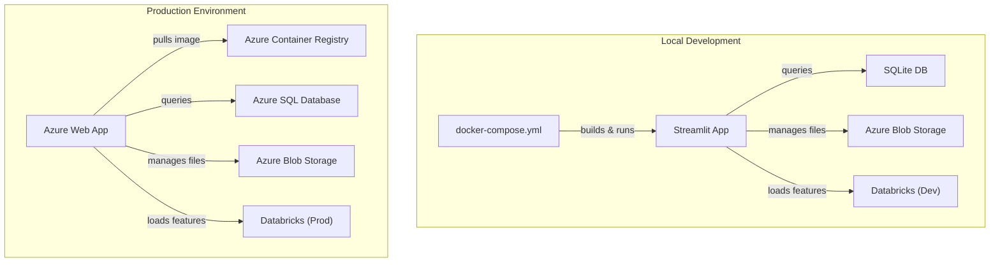

# Deployment & Operations Guide

## Deployment Architecture

### Docker Deployment



### Dockerfile Overview

```dockerfile
FROM python:3.11-slim
WORKDIR /app
COPY requirements.txt .
RUN pip install --no-cache-dir -r requirements.txt
COPY . .
EXPOSE 8501
CMD ["streamlit", "run", "app/app.py"]
```

**Key Points:**
- Python 3.11 slim image (lightweight)
- Streamlit port: 8501
- No cache for faster builds
- Volume mounting for data persistence

---

## Running the Application

### Local Development

#### Prerequisites
```bash
# Python 3.11+
# pip or conda
# Docker (optional)
```

#### Installation Steps

```bash
# 1. Clone repository
git clone <repo-url>
cd mb

# 2. Create virtual environment
python -m venv venv
.\venv\Scripts\Activate.ps1  # Windows PowerShell
source venv/bin/activate     # Linux/Mac

# 3. Install dependencies
pip install -r requirements-py311.txt

# 4. Configure secrets
# Copy template and add credentials
cp config/secrets.example.py config/secrets.py
# Edit with real credentials

# 5. Initialize database
python scripts/init_db.py

# 6. Run application
streamlit run app/app.py
```

#### Using Docker Compose

```bash
# Build and start all services
docker-compose up -d

# View logs
docker-compose logs -f streamlit-app

# Stop services
docker-compose down

# Rebuild after code changes
docker-compose up -d --build
```

### Production Deployment

#### Azure Container Registry (ACR) Push

```bash
# 1. Build Docker image
docker build -t mb-app:latest .

# 2. Tag for ACR
docker tag mb-app:latest <acr-name>.azurecr.io/mb-app:latest

# 3. Login to ACR
az acr login --name <acr-name>

# 4. Push image
docker push <acr-name>.azurecr.io/mb-app:latest

# 5. Deploy to Azure Web App
az webapp config container set \
  --name <web-app-name> \
  --resource-group <resource-group> \
  --docker-custom-image-name <acr-name>.azurecr.io/mb-app:latest \
  --docker-registry-server-url https://<acr-name>.azurecr.io \
  --docker-registry-server-username <username> \
  --docker-registry-server-password <password>
```

#### Environment Variables (Production)

```
# .env (NEVER commit to repo)
AZURE_STORAGE_ACCOUNT_NAME=<storage-account>
AZURE_STORAGE_ACCOUNT_KEY=<storage-key>
DATABRICKS_HOST=<databricks-workspace-url>
DATABRICKS_TOKEN=<databricks-token>
DATABASE_URL=<azure-sql-connection-string>
SECRET_KEY=<generated-secret-key>
```

---

## Monitoring & Logging

### Application Health Checks

```python
# Health endpoint
GET /health
Response: {
    "status": "healthy",
    "timestamp": "2026-01-29T10:00:00Z",
    "database": "connected",
    "storage": "connected",
    "databricks": "connected"
}
```

### Log Levels

| Level | Usage | Example |
|-------|-------|---------|
| DEBUG | Development | Variable values, function entry/exit |
| INFO | Important events | User login, module completion |
| WARNING | Potential issues | Low storage, slow queries |
| ERROR | Application errors | Database connection failure |
| CRITICAL | System failures | Complete service unavailable |

### Logging Configuration

```python
# config/logging_config.py
import logging

logging.basicConfig(
    level=logging.INFO,
    format='%(asctime)s - %(name)s - %(levelname)s - %(message)s',
    handlers=[
        logging.FileHandler('logs/app.log'),
        logging.StreamHandler()
    ]
)

logger = logging.getLogger(__name__)
```

### Azure Monitor Integration

```python
# Application Insights
from opencensus.ext.azure.log_exporter import AzureLogHandler

handler = AzureLogHandler(connection_string='InstrumentationKey=...')
logger.addHandler(handler)
```

---

## Database Backups

### Local SQLite Backup

```bash
# Daily backup script
cp mb/data/mb_app.db backups/mb_app_$(date +%Y%m%d).db

# Weekly full backup to Azure
az storage blob upload \
  --account-name <storage-account> \
  --container-name backups \
  --name mb_app_weekly_$(date +%Y%m%d).db \
  --file backups/mb_app_$(date +%Y%m%d).db
```

### Azure SQL Backup Policy

- **Automatic backups**: Daily (7 days retention)
- **Manual backups**: Weekly (30 days retention)
- **Geo-redundant**: Enabled
- **Point-in-time restore**: Last 35 days

---

## Performance Tuning

### Database Query Optimization

```sql
-- Add indexes for common queries
CREATE INDEX idx_users_email ON mb_users(email);
CREATE INDEX idx_modules_user ON learning_modules(user_id);
CREATE INDEX idx_features_timestamp ON student_daily_features(feature_timestamp DESC);

-- Analyze query performance
EXPLAIN QUERY PLAN
SELECT * FROM learning_modules WHERE user_id = ? AND status = 'active';
```

### Caching Strategy

```python
# Streamlit caching for database queries
@st.cache_data(ttl=3600)  # 1 hour cache
def load_user_modules(user_id):
    return db.query_modules(user_id)

# Cache databricks features
@st.cache_resource  # Cache resources
def get_databricks_connection():
    return databricks.connect()
```

### Scalability Considerations

| Metric | Current | Scalable To |
|--------|---------|-------------|
| Active Users | 50 | 5,000 |
| Daily Records | 200 | 20,000 |
| Database Size | 100 MB | 1 GB |
| Response Time | <500ms | <2s |

**Scaling Steps:**
1. Migrate SQLite → Azure SQL Database
2. Implement read replicas
3. Add Redis caching layer
4. Use CDN for static assets

---

## Troubleshooting

### Common Issues

#### 1. Database Connection Failed

```
Error: sqlite3.OperationalError: unable to open database file

Solution:
- Check file permissions
- Verify database path exists
- Run: python scripts/init_db.py
```

#### 2. Databricks Authentication Error

```
Error: java.rpc.RpcTimeoutException

Solution:
- Verify DATABRICKS_TOKEN in secrets.py
- Check workspace URL is correct
- Validate network connectivity
```

#### 3. Azure Storage Access Denied

```
Error: AuthorizationPermissionMismatchError

Solution:
- Verify storage account name
- Check account key (not connection string)
- Ensure blob container exists
- Verify managed identity has Storage Blob Data Contributor role
```

#### 4. Streamlit Port Already in Use

```bash
# Solution: Use different port
streamlit run app/app.py --server.port 8502
```

### Health Check Script

```bash
# scripts/health_check.sh
#!/bin/bash

echo "Checking database connection..."
sqlite3 mb/data/mb_app.db ".tables"

echo "Checking Databricks connection..."
python -c "from app.integrations.databricks_connector import DatabricksConnector; dc = DatabricksConnector(); print(dc.test_connection())"

echo "Checking Azure Storage connection..."
python -c "from app.data.blob_storage import BlobStorageManager; bsm = BlobStorageManager(); print(bsm.test_connection())"

echo "All checks completed!"
```

---

## Rollback Procedures

### Database Rollback

```bash
# 1. Identify backup to restore
ls -la backups/

# 2. Stop application
docker-compose stop streamlit-app

# 3. Restore backup
rm mb/data/mb_app.db
cp backups/mb_app_20260128.db mb/data/mb_app.db

# 4. Restart application
docker-compose start streamlit-app
```

### Code Rollback

```bash
# 1. Check recent commits
git log --oneline -10

# 2. Revert to previous version
git revert <commit-hash>

# 3. Rebuild and redeploy
docker build -t mb-app:latest .
docker push <acr-name>.azurecr.io/mb-app:latest
```

### Feature Flag Rollback

```python
# config/feature_flags.py
FEATURE_FLAGS = {
    'new_dashboard': False,      # Disable if issues
    'gamification': True,
    'survey_distribution': True,
    'ai_recommendations': False  # Coming soon
}
```

---

## Maintenance Windows

### Scheduled Maintenance

```
Weekly Maintenance Window:
- Time: Sunday 2-4 AM UTC
- Operations: Database maintenance, index optimization
- Impact: Service may be intermittently unavailable

Monthly Maintenance:
- Time: First Sunday, 1-3 AM UTC
- Operations: Full database backup, log cleanup
- Notification: Sent 1 week in advance
```

### Maintenance Checklist

- [ ] Backup database
- [ ] Run database integrity check
- [ ] Clear old logs (>30 days)
- [ ] Update dependencies
- [ ] Security patch review
- [ ] Performance metrics review
- [ ] Verify all integrations
- [ ] Test disaster recovery

---

## Version Management

### Release Strategy

```
Version Format: MAJOR.MINOR.PATCH

Examples:
- 1.0.0 - Initial release
- 1.1.0 - New feature release
- 1.0.1 - Bug fix release
- 2.0.0 - Major breaking changes

Git Tags:
git tag -a v1.0.0 -m "Release version 1.0.0"
git push origin v1.0.0
```

### Dependency Updates

```bash
# Check for outdated packages
pip list --outdated

# Update specific package
pip install --upgrade package-name

# Update all packages
pip freeze > requirements-updated.txt
pip install -r requirements-updated.txt --upgrade

# Update requirements file
pip freeze > requirements-py311.txt
git add requirements-py311.txt
git commit -m "chore: update dependencies"
```

---

**Last Updated**: January 29, 2026
**Maintained By**: Development Team
